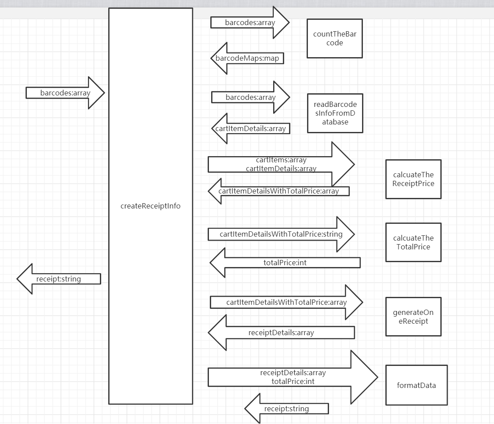

# Requirement
A cash register (POS) system is used in the store for settlement of the store. This cashier will settle and print the receipt (Receipt) according to the item(Item) in the customer's shopping cart (Cart) at the time of settlement.

We need to implement a function called printReceipt, which can input the data of the specified format as a parameter and then output the text of the receipt in the browser console.

This time, the input will be an array of barcodes (string). For example:
```javascript
[
  'ITEM000000',
  'ITEM000000',
  'ITEM000000',
  'ITEM000000',
  'ITEM000000',
  'ITEM000001',
  'ITEM000001',
  'ITEM000004'
]
```

Then the output should be 
```
***<store earning no money>Receipt ***
Name: Coca-Cola, Quantity: 5, Unit price: 3 (yuan), Subtotal: 15 (yuan)
Name: Sprite, Quantity: 2, Unit price: 3 (yuan), Subtotal: 6 (yuan)
Name: Battery, Quantity: 1, Unit price: 2 (yuan), Subtotal: 2 (yuan)
----------------------
Total: 23 (yuan)
**********************
```

Suppose that our database is as follows:
```javascript
[
   {
      barcode: 'ITEM000000',
      name: 'Coca-Cola',
      price: 3
    },
    {
      barcode: 'ITEM000001',
      name: 'Sprite',
      price: 3
    },
    {
      barcode: 'ITEM000002',
      name: 'Apple',
      price: 5
    },
    {
      barcode: 'ITEM000003',
      name: 'Litchi',
      price: 15
    },
    {
      barcode: 'ITEM000004',
      name: 'Battery',
      price: 2
    },
    {
      barcode: 'ITEM000005',
      name: 'Instant Noodles',
      price: 4
    }
]
```

# Principal

1. Please draw context diagram.
2. Please declare all the methods according to your diagram.
3. Please implement the function according to the context diagram
4. Please repeat step 3 until all functions are implemented.

# Tasking
- 统计每个barcode的个数
    - input: barCodes:[String]
    - output: cartItems:[{barCodeNumber:String,num:int}]
- 读取barcode详细信息
    - input: barCodes:[String]
    - output: cartItemDetails:[{barcode:String,name:String,price:int}]
- 计算每个receipt的金额
    - input: cartItems:[{barCodeNumber:String,num:int}]
    - cartItemDetails:[{barcode:String,name:String,price:int}]
    - output: cartItemDetailsWithTotalPrice:[{barcode:String,name:String,quantity:int,unitPrice:int,totalPrice:int}]
- 计算总金额：
    - input: cartItemDetailsWithTotalPrice:[{barcode:String,name:String,quantity:int,unitPrice:int,totalPrice:int}]
    - output: totalPrice:int
- 生成receipts详细信息：
    - input: cartItemDetailsWithTotalPrice:[{barcode:String,name:String,quantity:int,unitPrice:int,totalPrice:int}]
    - output: receiptDetails:[String]
- 格式化我们的数据:
    - input: receiptDetails:[string]
    - totalPrice:int
    - output: receipt:string
- 输出数据
    - input: receipt:string
    - output: 打印到控制台上




   | | countTheBarcode
  ---|---
  plan | 3min
  do | 13min
  Check| 对js有些知识不太了解
  Action| 针对这部分知识进行了解


   | | readBarcodesDetailFromDatabase
  ---|---
  plan | 3min
  do | 3min
  Check| The time estimates are basically consistent
  Action| The simpler the task breakdown, the better the time estimation


   | | calcuateTheReceiptPrice
  ---|---
  plan | 3min
  do | 7min
  Check| Spend time creating objects and valuation
  Action| Mechanical programming also spent time 


   | | generateReceipts
  ---|---
  plan | 3min
  do | 5min 
  Check| 使用到了一种之前没有接触到的方法
  Action| 多加练习，在后面更快的使用


   | | formatData
  ---|---
  plan | 3min
  do | 5min
  Check| Copying the original format took a while
  Action| maybe should calculation more time


